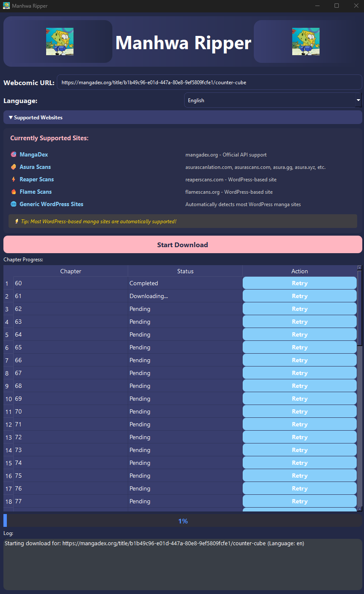

# Webcomic Downloader

A manga/webcomic downloader with a simple GUI for Windows. Just plug in the link (currently only working for MangaDex) and start downloading your favorite comics with ease.

---

## Features
- Simple, user-friendly interface
- Download manga/webcomics from MangaDex by pasting the link
- Automatic download to the `downloads/` folder
- Animated UI elements for a better experience

---

## Installation

### Windows
1. Make sure you have the latest version of [Python](https://www.python.org/downloads/) installed.
2. Download or clone this repository.
3. Double-click `run_windows.bat` to install all main requirements automatically.

---

## Usage
1. Run `run_windows.bat` (or run `python main.py` if you prefer the command line).
2. Paste a MangaDex link into the application.
3. Click to start downloading. Files will be saved in the `downloads/` folder.

---

## Screenshot

---

## Requirements
- Latest Python (3.8+ recommended)
- All other dependencies are installed automatically via `run_windows.bat`

---

## License
Open source, free to use.

---

## Credits
Created by Alex E. 